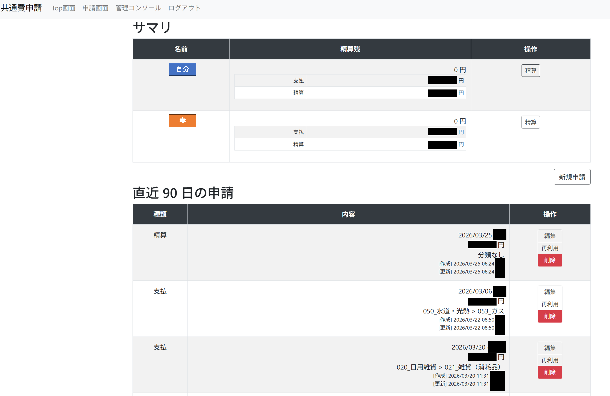
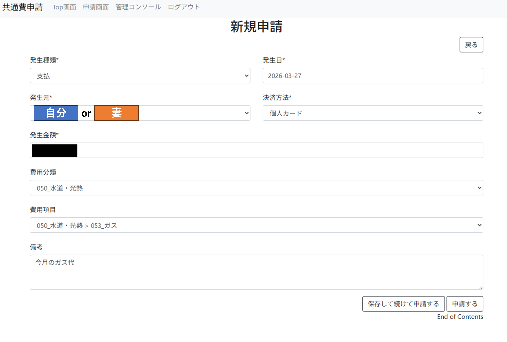
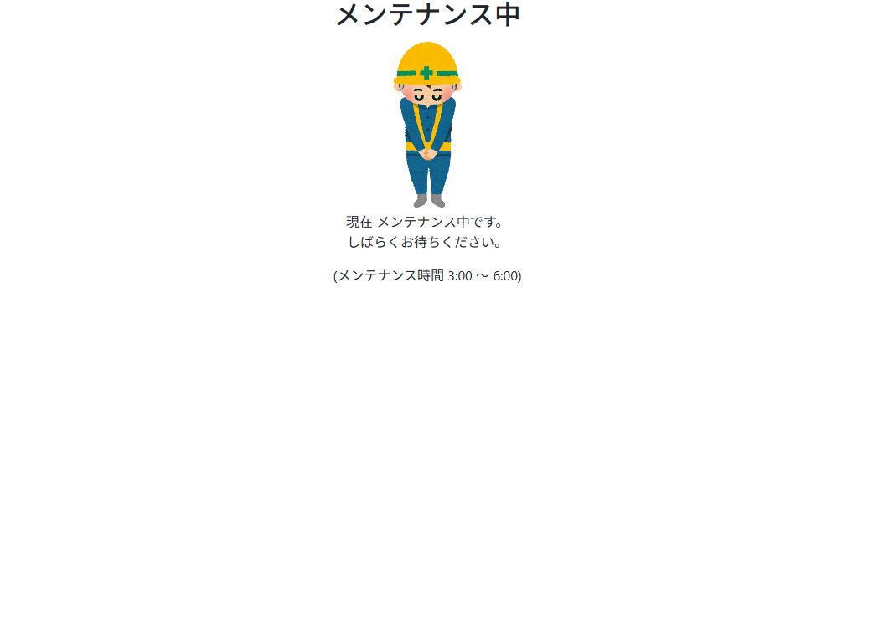
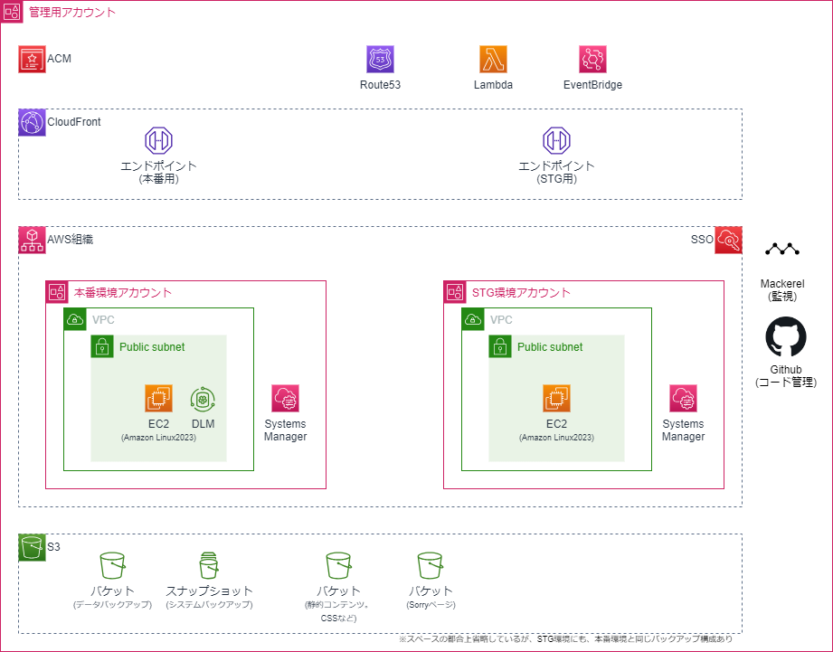

# 共通費申請アプリ — プロジェクト紹介

> [!Note]
> 本資料の土台は [Claude Code](https://claude.ai/code) を使用して作成しています。

---

## 1. プロジェクト概要

### アプリの目的

2人の家族間で共通生活費（食費・光熱費など）を管理・精算するWebアプリケーション。

| 項目 | 内容 |
|---|---|
| 本番 URL | XXXX |
| STG URL | XXXX |
| 開発 URL | XXXX |
| 開発体制 | 個人開発（1名） |

### アプリの主な機能

- 共通費の申請・一覧表示・精算
- 申請時にメール通知
- レスポンシブデザイン（PC・スマートフォン対応）
- 申請の再利用機能

### 技術スタック（アプリ層）

| カテゴリ | 技術 |
|---|---|
| バックエンド | Python / Django |
| フロントエンド | Bootstrap |
| データベース | SQLite |
| アプリサーバ | uWSGI |
| Webサーバ | Nginx |
| OS | Amazon Linux (EC2) |
| 監視 | Mackerel（無料版） |

### 画面イメージ

#### トップ画面


#### 申請画面


#### 通知メール


#### メンテナンス画面


---

## 2. AWS アーキテクチャ

### 構成図



### 設計コンセプト

> **「とにかく安く、でも本格的に」**
> コスト目標: **1,000円/月以下**

マネージドサービスを最大限活用し、運用負荷を最小化しながらコスト効率を追求した構成。

---

### 2-1. マルチアカウント構成

AWS Organizations を用いてアカウントを階層管理。

```
AWS Organizations root
├── 管理アカウント、兼共用アカウント (ネットワーク・DNS層)
│   ├── Amazon Route 53
│   ├── Amazon CloudFront + AWS ACM
│   ├── Amazon S3 (静的ファイル・Sorryコンテンツ・DBバックアップ)
│   ├── Amazon EventBridge (クロスアカウントイベントバス)
│   └── AWS Lambda (Route53 Aレコード自動更新)
│
├── 本番アカウント (アプリ層)
│   ├── Amazon EC2 (Djangoアプリ)
│   ├── AWS Systems Manager (自動化)
│   ├── Amazon EventBridge (スケジュール・イベント発火)
│   └── Amazon DLM (週次スナップショット)
│
└── 開発アカウント (アプリ層) ※本番と同構成
```

**マルチアカウントの利点**
- 本番／開発の障害影響を完全に分離
- IAMポリシーをアカウント単位で独立管理
- AWS Organizations による一元的なアカウント管理

---

### 2-2. 利用 AWS サービス一覧

#### 共用アカウント

| サービス | 用途 | Well-Architectedの観点 |
|---|---|---|
| **AWS Organizations** | 各アカウントの一元管理 | 運用上の優位性 |
| **Amazon Route 53** | DNSおよびドメイン管理 | 信頼性 |
| **Amazon CloudFront** | SSLアクセラレータ、静的ファイルキャッシュ、EC2/S3へのルーティング | パフォーマンス効率・セキュリティ |
| **AWS ACM** | SSL/TLS証明書の管理（自動更新） | セキュリティ・運用上の優位性 |
| **Amazon S3** | 静的ファイル・Sorryコンテンツ配信、SQLiteバックアップ保管 | 信頼性・コスト最適化 |
| **Amazon EventBridge** | クロスアカウントのイベントバス（Lambda起動など） | 運用上の優位性 |
| **AWS Lambda** | EC2起動時のRoute53 Aレコード自動更新 | 運用上の優位性・コスト最適化 |

#### 各アカウント（本番・開発）

| サービス | 用途 | Well-Architectedの観点 |
|---|---|---|
| **Amazon EC2** | Djangoアプリのホスティング。`t3.micro` を年間 RI で購入 | パフォーマンス効率 |
| **AWS Systems Manager** | EC2の定期起動・停止（Automation） | 運用上の優位性・コスト最適化 |
| **Amazon EventBridge** | EC2の定期起動・停止スケジュール、イベント発火 | 運用上の優位性 |
| **Amazon DLM** | EBSの週次スナップショット自動取得 | 信頼性 |
| **S3 VPCエンドポイント** | EC2からS3へのプライベート通信 | セキュリティ |

---

## 3. 工夫したポイント（AWS アーキテクチャ）

### 3-1. EC2 定期起動・停止によるコスト削減

サービス提供時間を **深夜帯** に限定し、夜間3時間はEC2を停止。
※なお、開発環境は常時停止。検証が必要な時のみ起動する。

```
EventBridge (cron) → SSM Automation → EC2 起動/停止
```

**コスト効果**: EC2 稼働を 削減。パブリック IPv4 アドレス課金も停止中は発生しない。

……のだったのが、途中から年間 RI 購入に切り替えたため、特に止める必要はなくなった (ただし、パブリック IPv4 の課金は停止するので、全く無駄なわけではない)。ただし、本番運用のイメージ & 安定稼働のために、定期停止・定期起動の運用は残している。

---

### 3-2. Lambda による動的 DNS 自動更新

EC2 停止中はパブリック IP が解放されるため、起動時に IP が変わる。
**Elastic IP を使わず**、Lambda + EventBridge で Route53 を自動更新する設計を採用。

```
EC2 起動
  → EventBridge (EC2 State Change 検知)
    → クロスアカウントイベントバス (各アカウント → 共用アカウント)
      → Lambda (共用アカウント。STS AssumeRole)
        → Route53 Aレコード UPSERT
```

**Elastic IP 不使用の理由**
- 停止中の Elastic IP にも課金が発生（2024年以降は稼働中も課金）
- Lambda + Route53 による動的更新で IP 管理コストをゼロに

**EC2 タグ連携**: EC2 の `IPv4FQDN` タグに FQDN を設定するだけで、Lambda が自動的に対象ホスト名を解決する柔軟な設計。

---

### 3-3. クロスアカウントアクセス（STS AssumeRole）

S3 バックアップ・Route53 更新いずれも、アカウント間のリソースアクセスに **STS AssumeRole** を活用。

```
本番アカウント (EC2 / Lambda)
  → sts:AssumeRole
    → 共用アカウント (S3 / Route53)
```

- EC2 インスタンスロール → AssumeRole → S3 クロスアカウントアクセス
- Lambda 実行ロール → AssumeRole → Route53 操作（共用アカウント）
- 最小権限の原則に従い、必要なアクションのみを許可するポリシーを設計

---

### 3-4. 多層バックアップ戦略

| バックアップ種別 | 手段 | 頻度 | 保管先 |
|---|---|---|---|
| **データバックアップ** (SQLiteファイル) | EventBridge → SSM Run Command → S3 cp | 毎日深夜 | Amazon S3 |
| **システムバックアップ** (EBSスナップショット) | Amazon DLM | 毎週日曜深夜 | EBSスナップショット |

- データ（SQLite）は軽量なためS3への日次コピーが容易
- EBSスナップショットにより、OSレベルの障害にも対応
- RPO（目標復旧時点）: データ最大24時間 / システム最大7日間

---

### 3-5. CloudFront による統合エントリーポイント

```
クライアント
  → Amazon CloudFront (+ AWS ACM による HTTPS)
    ├── /static/* → Amazon S3 (静的ファイル)
    ├── /sorry.html → Amazon S3 (メンテナンスページ)
    └── /* → Amazon EC2 (Djangoアプリ)
```

- **SSL/TLS**: ACM 証明書を CloudFront にアタッチ（証明書の自動更新）
- **オリジンの抽象化**: EC2 の IP が変わっても、ユーザーは CloudFront のドメインのみ意識すれば良い
- **コスト削減**: 静的ファイルを S3 からキャッシュ配信することで EC2 の負荷を低減
- **フェイルオーバー**: EC2 停止中（メンテナンス時間帯）は S3 の Sorry コンテンツを表示

---

## 4. AWS Well-Architected フレームワークの観点

| 柱 | 取り組み |
|---|---|
| **運用上の優位性** | EventBridge + SSM による EC2 の自動起動・停止、Lambda による DNS 自動更新、DLM によるスナップショット自動取得 |
| **セキュリティ** | CloudFront + ACM による HTTPS 強制、S3 VPC エンドポイントによるプライベート通信、STS AssumeRole による最小権限のクロスアカウントアクセス |
| **信頼性** | マルチアカウント構成による環境分離、多層バックアップ（S3 日次 + DLM 週次）、CloudFront による高可用な配信 |
| **パフォーマンス効率** | CloudFront による静的ファイルキャッシュ、サービス要件に合わせた EC2 インスタンスタイプ選定 |
| **コスト最適化** | Elastic IP 不使用（Lambda + Route53 で代替）、S3 + CloudFront による静的配信でEC2負荷低減、マネージドサービス活用による運用コスト削減 |
| **サステナビリティ** | EC2 夜間停止によるコンピューティングリソースの節約 |

---

## 5. コスト構造（目標: 1,000円/月以下）

為替によりけりだが、おそらく 1,000円/月は切っていると思う。

| サービス | 備考 |
|---|---|
| Amazon EC2 | 軽量インスタンスタイプ (`t3.micro`) の利用、年間 RI の利用
| Amazon VPC | パブリック IPv4 の利用料 |
| Amazon S3 | データ容量が小さいため数円以下 |
| Amazon CloudFront | 無料利用枠内を想定 |
| Amazon Route 53 | ホストゾーン料金のみ |
| AWS Lambda | 無料利用枠内を想定 |
| AWS ACM | 無料（CloudFront との組み合わせ） |
| Amazon DLM | スナップショットストレージ費のみ |

---

以上
